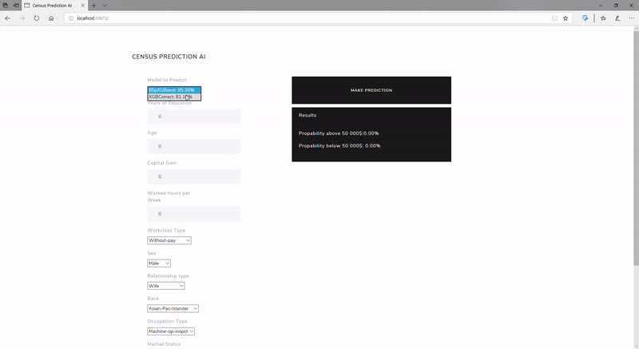

# MVC_CensusPrediction
MVC application which predicts (basing on user input) the probability of citizen's income either below or above 50 000 dollars.  
This application uses predictive model - **XGBoost** (python library), which is trained and later stored in the database. 
Dataset comes from UCI Machine Learning Repository: https://www.kaggle.com/uciml/adult-census-income/downloads/adult.csv/3  
**Showreel** 

